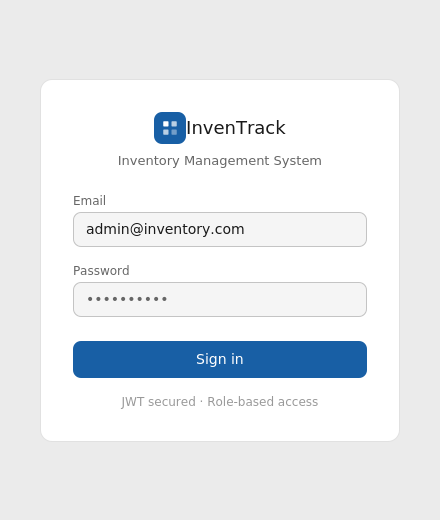
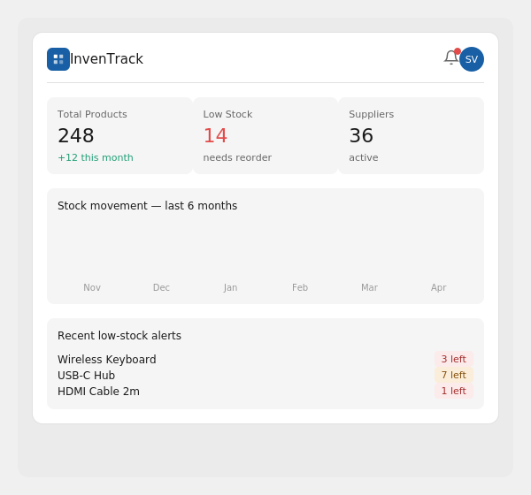

# InvenTrack — Industry-Grade Inventory Management System

> Full-stack: ASP.NET Core .NET 9 + React.js + MS SQL Server (LocalDB)

## Screenshots

### Login Page


### Dashboard


---

## Quick Start

### Backend
```bash
cd backend
dotnet restore
dotnet ef migrations add IndustryUpdate
dotnet ef database update
dotnet run
# API: http://localhost:5000
# Swagger: http://localhost:5000/swagger
```

### Frontend
```bash
cd frontend
npm install
npm run dev
# App: http://localhost:5173
```

## Login Credentials
| Role | Email | Password |
|------|-------|----------|
| Admin | admin@inventory.com | Admin@123 |

---

## Features

### Backend (Industry Level)
- JWT Authentication + Role-based access (Admin / Staff)
- Global Exception Middleware with structured error responses
- Rate Limiting (100 req/min per IP)
- Audit Logging — every action tracked with user + IP
- Notification System with low-stock alerts
- Excel Export (Products + Stock Logs) via ClosedXML
- QR Code generation per product
- Serilog file + console logging with daily rolling
- Reports API — inventory summary, stock movement charts
- User Management (Admin only)
- Database indexes for performance

### Frontend (Industry Level)
- Dashboard with live stats
- Reports page with Recharts visualizations
- Excel export buttons
- Notification bell with real-time unread count
- User Management (Admin only)
- Audit Logs viewer (Admin only)
- Dark / Light mode toggle
- Mobile-first responsive (bottom tab nav on mobile)
- Role-based route protection

---

## Tech Stack

| Layer | Technologies |
|-------|-------------|
| Backend | C# · ASP.NET Core .NET 9 · EF Core · SQL Server · JWT · BCrypt · Serilog · ClosedXML · QRCoder · FluentValidation |
| Frontend | React 18 · Vite · Tailwind CSS · Axios · React Router · Recharts · Lucide Icons |

---

## Author
**Siddhesh Vetal** — .NET Backend Developer
[LinkedIn](https://linkedin.com/in/siddhesh-vetal) · [GitHub](https://github.com/sidh21)
